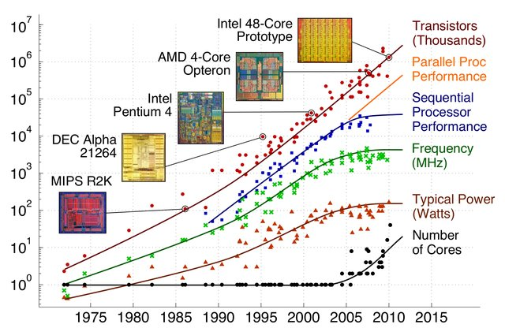

# Motivation behind Cpp-Taskflow

Cpp-Taskflow is motivated by the fact that 
the evolution of computer architecture is moving toward multicore designs,
and the insufficiencies of existing parallel programming tools in support for modern C++.
In this section, we first brief the history of computer architecture
and then discuss the necessity of parallel programming.
We will show different parallel programming paradigms and the motivation behind Cpp-Taskflow.

# The Era of Multicore

In the past, we embrace *free* performance scaling on our software thanks to 
advances in manufacturing technologies and micro-architectural innovations.
Approximately for every 1.5 year we can speed up our programs by simply switching to new
hardware and compiler vendors that brings 2x more transistors, faster clock rates, 
and higher instruction-level parallelism.
However, this paradigm was challenged by the power wall and increasing difficulties in exploiting
instruction-level parallelism.
The boost to computing performance has stemmed from changes to multicore chip designs.

The above sweeping visualization (thanks to Prof. Mark Horowitz and his group) 
shows the evolution of computer architectures is moving toward multicore designs.
Today, multicore processors and multiprocessor systems are common
in many electronic products such as mobiles, laptops, desktops, and servers.
In order to keep up with the performance scaling, 
it is becoming necessary for software developers to write parallel programs 
that utilize the number of available cores.

# Parallel Programming

## Toward Task-based Parallel Programming

The traditional *loop-level* parallelism extracts parallel tasks from *loops*
to speed up the program in line with [Amdahl's law][Amdahl's law].
However, the loop-based approach hardly allows users 
to exploit parallelism in more irregular applications such as graph algorithms,
incremental flows, recursion, and dynamically-allocated data structures.
To address these challenges,
parallel programming and libraries are evolving from tradition loop-based parallelism to the
the *task-based* model.
Task-based model offers a powerful means to express both regular 
and irregular parallelism in a top-down manner, 
and provides transparent scaling to large number of cores.
In fact, it has been proven, both by the research community and 
the evolution of parallel programming standards, 
task-based approach scales the best with future processor generations and architectures.

* * *

[Amdahl's law]:    https://en.wikipedia.org/wiki/Amdahl%27s_law
